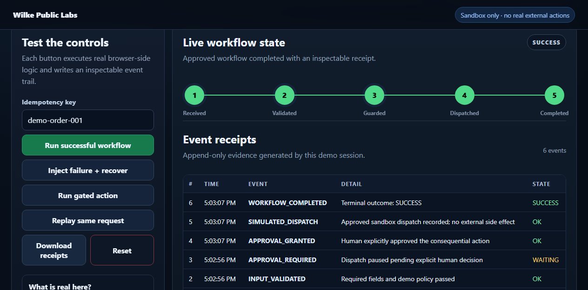

# Wilke Public Labs

Public, inspectable capability demos for automation, workflow reliability, and AI-assisted systems.

## Why this repository exists

Freelance profiles and claims are weak evidence. This repository is the opposite: small runnable demos with source code, explicit truth boundaries, and reproducible tests.

## Live labs

### 01 — Automation Reliability Lab

Interactive browser sandbox demonstrating:

- deterministic workflow state transitions
- bounded retry and fallback recovery
- idempotency / duplicate suppression
- explicit human approval before consequential dispatch
- timestamped, downloadable event receipts
- safe no-side-effect sandbox behavior

**Live demo:** https://itsmeb-lab.github.io/wilke-public-labs/automation-reliability-lab/



### 02 — Windows Process Recovery Watchdog

Real PowerShell watchdog plus an interactive browser mirror demonstrating:

- start when absent
- avoid duplicate starts while healthy
- restart after crash with a fresh PID
- timestamped watchdog receipts
- fixture tests covering all three states

**Live demo:** https://itsmeb-lab.github.io/wilke-public-labs/windows-process-recovery-watchdog/

**Public lab index:** https://itsmeb-lab.github.io/wilke-public-labs/

## Run locally

```bash
npm test
python -m http.server 8080
```

Then open either:

- `http://localhost:8080/automation-reliability-lab/`
- `http://localhost:8080/windows-process-recovery-watchdog/`

## Windows watchdog fixture

On Windows PowerShell:

```powershell
.\windows-process-recovery-watchdog\powershell\Test-ProcessWatchdog.ps1
```

## Truth boundary

These are public capability demonstrations, not paid-client production deployments, customer data, or claims of external ROI. External side effects in browser labs are deliberately simulated.

## Public-safety boundary

This repository is intentionally separate from private Wilke ecosystem repositories. It must not contain:

- credentials, tokens, cookies, or secrets
- customer or prospect private data
- private architecture or internal controller state
- absolute workstation paths
- private email addresses
- proprietary source copied from private repositories without review

## License

MIT. See [LICENSE](./LICENSE).
